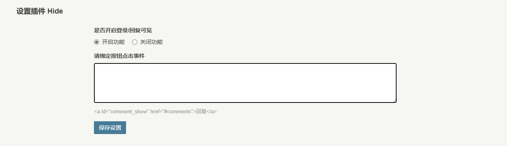

# 插件说明
一款支持让你的文章内容评论/登录可见的插件。

插件设置界面：



博客主页：


博客详情：


在写博客时，只需要遵守下面的语法就可以实现**隐藏内容**的效果。
```
[hide]
该部分内容需回复可见
[/hide]
[login]
该部分内容仅登录可见
[/login]
```

# 使用步骤
1. [替换`post.php`中文章内容输出语句](#替换内容输出语句)
2. [自定义**登录**点击事件（可选）](#绑定评论点击事件)


## 替换内容输出语句
在主题文件夹下`post.php`中找到文章内容输出语句，以`default`主题为例：
```php
<div class="post-content" itemprop="articleBody">
    <?php parseContnet($this->content); ?>
</div>
```

在`div`区块间加入文章内容替换语句
```php
<?php
    if (array_key_exists('Hide', Typecho_Plugin::export()['activated'])) {
        $this->content = Hide_Plugin::parse_content($this->content, $this->cid, $this->remember('mail',true), $this->user->hasLogin(), $this->options->adminUrl);
    }
?>
```

最后`post.php`文件内容如下（仅输出文章内容部分）：
```php
<div class="post-content" itemprop="articleBody">
    <?php
        if (array_key_exists('Hide', Typecho_Plugin::export()['activated'])) {
            $this->content = Hide_Plugin::parse_content($this->content, $this->cid, $this->remember('mail',true), $this->user->hasLogin(), $this->options->adminUrl);
        }
    ?>
    <?php parseContnet($this->content); ?>
</div>
```

## 绑定评论点击事件
在`footer.php`中`<body>`块中添加点击事件
```php
<?php if (array_key_exists('Hide', Typecho_Plugin::export()['activated'])) : Hide_Plugin::commentClick(); endif; ?>
```

仍以`default`主题为例，可在如下位置插入点击事件语句：
```php
<?php $this->footer(); ?>
<?php if (array_key_exists('Hide', Typecho_Plugin::export()['activated'])) : Hide_Plugin::commentClick(); endif; ?>
</body>
```

## 设置按钮点击事件
当内容被隐藏时评论才可见的`HTML`代码如下：
```html
<div class="reply2view" style="font-weight:bolder; color:#336699;">您需要<a id="comment_show" href="#comments">回复</a>才能显示此处隐藏内容。</div>
```

回复点击事件就是点击**回复**之后会打开评论框，需要根据使用的主题进行微调，**<font color="blue">同时注意在配置界面填写点击事件代码时`<script>`与`</script>`不可省略</font>**。
```php
<script>
$("#comment_show").click(function() {
    $("#comments").fadeIn(1000);
});
</script>
```