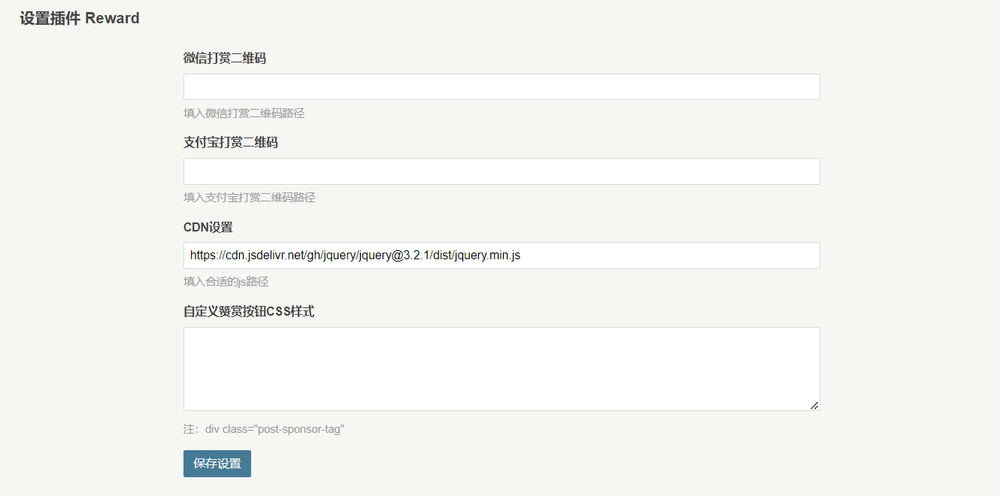

# 插件说明
在文章底部展示一段打赏文字。

预览：


设置界面：



# 使用步骤
1. 在设置界面填写微信打赏二维码、支付宝打赏二维码地址
2. 自定义`jquery`（可选）
3. 自定义CSS样式（可选）
4. 在主题文件夹`post.php`文件中添加打赏输出语句

以`default`主题为例，在文章输出语句的下方添加按钮输出语句`<?php if (array_key_exists('Reward', Typecho_Plugin::export()['activated'])) : Reward_Plugin::show(); endif; ?>`
```php
<div class="post-content" itemprop="articleBody">
    <?php $this->content(); ?>
</div>
<?php if (array_key_exists('Reward', Typecho_Plugin::export()['activated'])) : Reward_Plugin::show(); endif; ?>
```